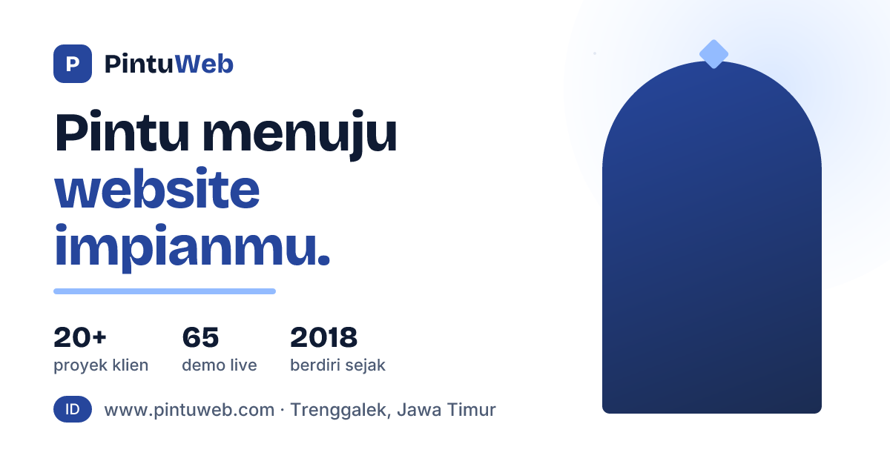

# PintuWeb — Jasa Pembuatan Website Profesional & Cepat

Situs utama PintuWeb, "pintu menuju website impianmu": jasa pembuatan website untuk UMKM, startup, dan personal brand, lengkap dengan 65 demo live yang bisa dicoba langsung.

**Live:** https://pintuweb.com



## Halaman

| Rute | Isi |
|---|---|
| `/` | Beranda: hero, layanan, target industri, cara kerja, showcase portal, perbandingan, ringkasan harga, FAQ |
| `/paket` | Enam paket beserta harga, fitur, dan tombol pesan via WhatsApp |
| `/demo` | Galeri 65 demo live dengan filter kategori |
| `/services` | Rincian layanan |
| `/about` | Tentang PintuWeb |
| `/faq` | Pertanyaan umum |
| `/kontak` | Formulir yang membuka pesan WhatsApp atau email (tanpa backend) |
| `/owner` | Profil pemilik |

## Sumber data

Konten yang sering berubah dipusatkan supaya tidak pernah saling bertentangan:

- `app/lib/packages.ts` — **satu-satunya sumber harga**. Dibaca oleh `/paket`, ringkasan harga di beranda, JSON-LD `offers` di layout, dan jawaban FAQ soal harga. Ubah harga hanya di file ini.
- `app/lib/demos.ts` — daftar 65 demo (landing 17, link-in-bio 12, kontes 9, undangan 8, portfolio 7, reservasi 5, properti 4, to-do 3) untuk `/demo`.
- `app/lib/faqData.ts` — isi FAQ, dipakai komponen FAQ dan JSON-LD `FAQPage`.

## Identitas visual

Tinta hangat, kertas krem, cobalt sebagai warna utama, dan aksen amber. Motif khasnya adalah **gerbang/arch** (kartu showcase dan visual hero berujung atas melengkung) serta grid cetak biru. Judul memakai Bricolage Grotesque, teks memakai Inter. Semua warna berupa variabel CSS di `app/globals.css`, jadi seluruh tema bisa diubah dari satu tempat.

## Teknologi

- Next.js 15.5 (App Router), React 19, TypeScript
- Tailwind CSS v4
- Vercel Analytics
- SEO: metadata dan canonical per halaman, Open Graph, JSON-LD (Organization, WebSite, Service, FAQPage, BreadcrumbList, ItemList), sitemap dan robots dinamis

## Menjalankan secara lokal

```bash
npm install
npm run dev
```

Buka http://localhost:3000. Untuk build produksi: `npm run build` lalu `npm start`.

## Deploy

Project ini ter-link ke Vercel (`.vercel/`, tidak di-commit). Deploy produksi dijalankan manual:

```bash
vercel deploy --prod
```

## Portal demo

Setiap kategori demo punya katalognya sendiri:
[PortalLanding](https://www.pintuweb.com/landing-page) ·
[PortalBio](https://www.pintuweb.com/link-in-bio) ·
[PortalKontes](https://www.pintuweb.com/kontes-desain) ·
[PortalUndangan](https://www.pintuweb.com/undangan-digital) ·
[PortalPorto](https://www.pintuweb.com/website-portofolio) ·
[PortalReservasi](https://www.pintuweb.com/website-reservasi) ·
[PortalProperti](https://www.pintuweb.com/website-properti) ·
[PortalTodo](https://www.pintuweb.com/aplikasi-to-do)
